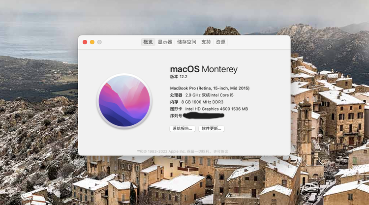

# Dell-7447-OpenCore-EFI-hub
### 版本说明

Opencore版本：0.7.7

系统支持情况：MacOS Monterey 12.2

### 示例图

示例图已过期，等待下次更新，目前仅供参考

### 不可用功能：

- GTX 850M 或 GTX 950M 独立显卡
- Intel无线网卡（建议更换博通BCM94352z网卡以实现完整功能）
- SDCard 内置读卡器
- 屏幕亮度多功能快捷键（可以使用Fn + S 和 Fn + B 替换使用）

### 可用功能：

- 除不可用功能外都可用
- 实测可在线OTA升级（Monterey 12.1 ------>Monterey  12.2）
- 声卡驱动ALC255完整支持内置扬声器及3.5mm耳机接口（使用的layout-id=30）

